# Items

Balance variety (GLAM domain) and representativeness for the domain.

We operated a selection within the total amount of cultural objects described in the ekphrasis and recognized by the scholars applying three selection criteria: first, objects have to be published on the web with their metadata by a cultural institution responsible for the curation of the object and the data. Second, objects metadata had to follow a standardized description, preferably some kind of international standards for metadata. Lastly, the selection had to contain a balanced variety of objects coming from the GLAM domain. In addition to these criteria, we also considered scholarly interpretations to guide our search so that items included in the sample exemplify intermedial references within the ekphrasis and even external and wider relations to be modeled. 

The final selection is composed by 14 items, including Sanguineti text itself and two other cultural objects not mentioned within the chapters but related to the work “Il Giuoco dell’Oca” as well: one is the board game “Game of the Goose” from which Sanguineti is inspired by, the other is the artwork by the Italian artist Gianfranco Baruchello titled “Il Giuoco dell’Oca di Edoardo Sanguineti”, conceived after and in honor of his friend’s novel, recreating the traditional board game in a new way. All items are accompanied by metadata following, when possible, international standard, otherwise those built on proprietary schema have been aligned with the a proper standard selected among those used in the corresponding domain.

problems connected with contemporary objects: not described properly - copyright problems - lack of digital reproductions (images), just metadata

## 1. Il Giuoco dell'Oca

- 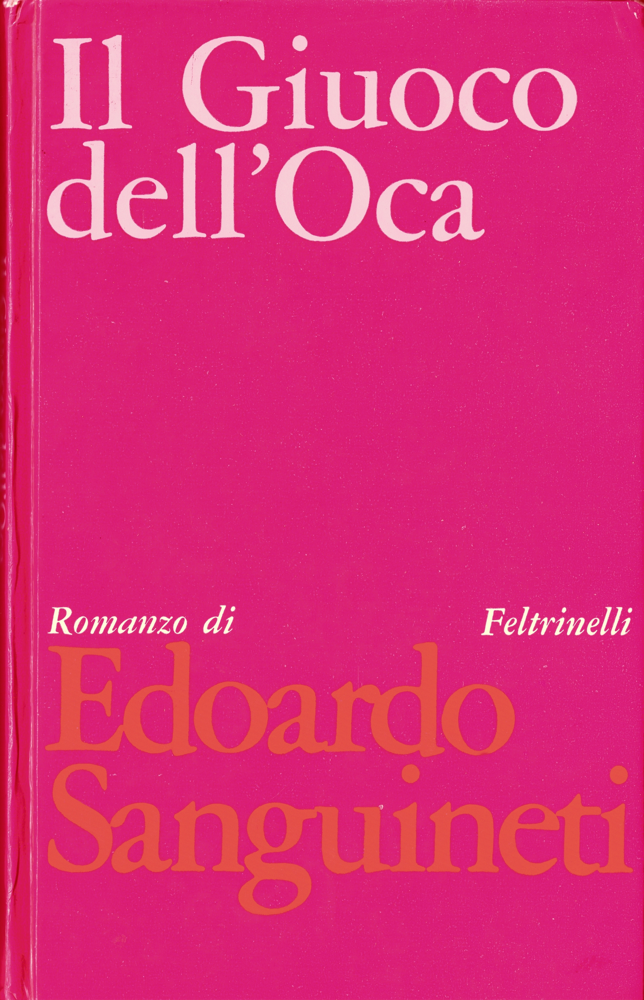
- 
	<li class="span-2">
		
	</li>

A novel by Edoardo Sanguineti

## 2. Game of the Goose

- 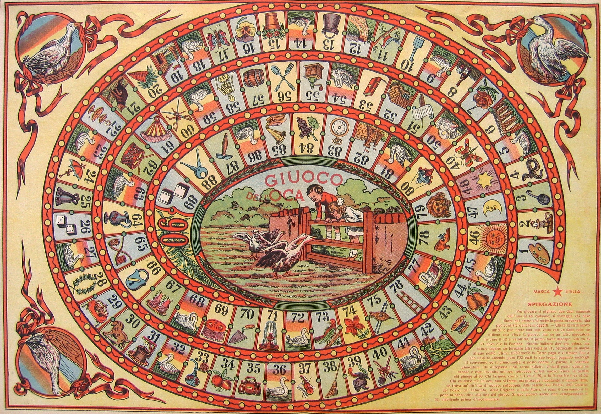

A board game by Marca Stella

## 3. Il Giuoco dell'Oca di Edoardo Sanguineti

- 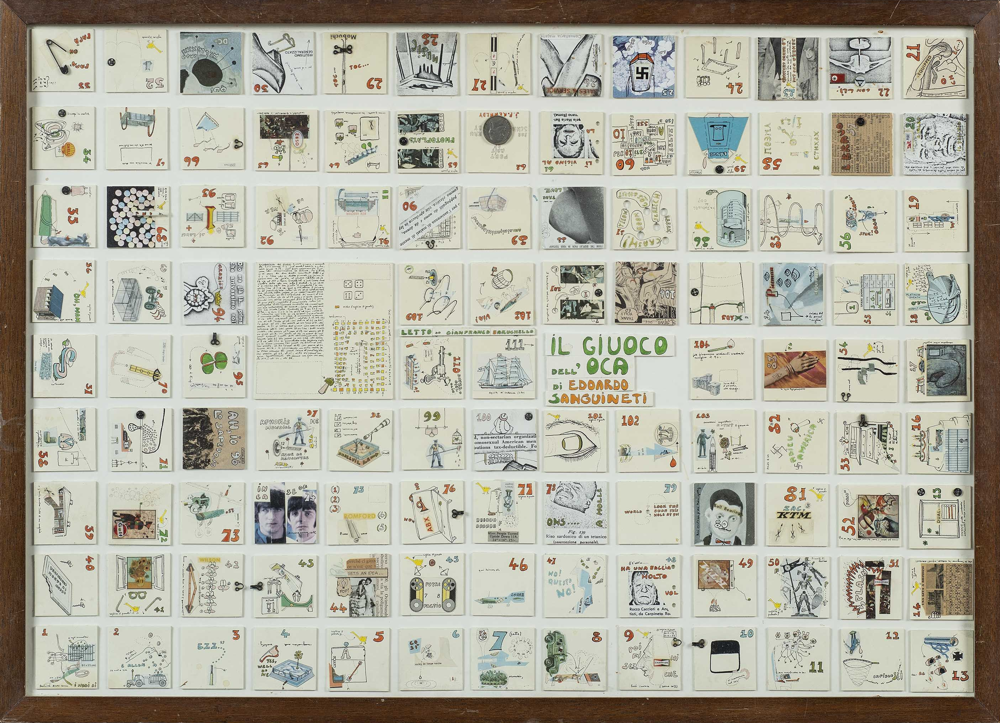

A collage by Gianfranco Baruchello

## 4. Cassa Sistina

- 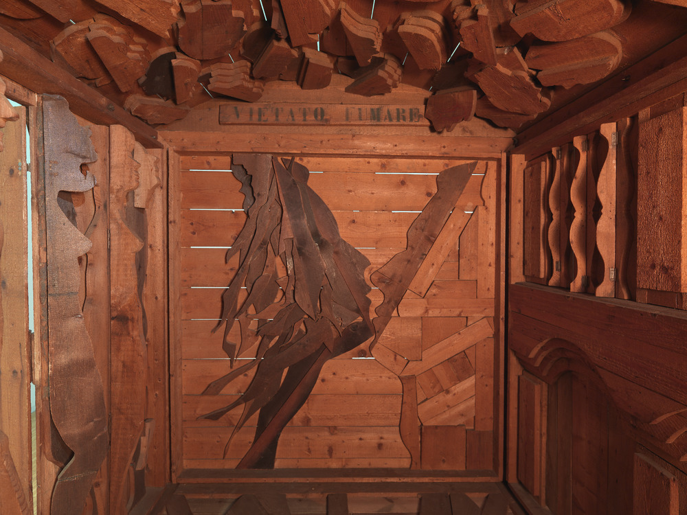

A sculpture by Mario Ceroli

## 5. Vampyr

- 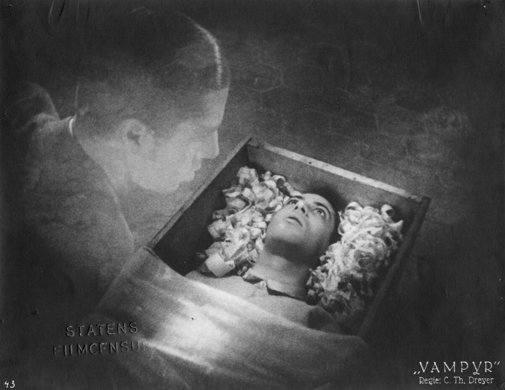

A film by Carl Theodor Dreyer

## 6. Symbols of Transformation

- 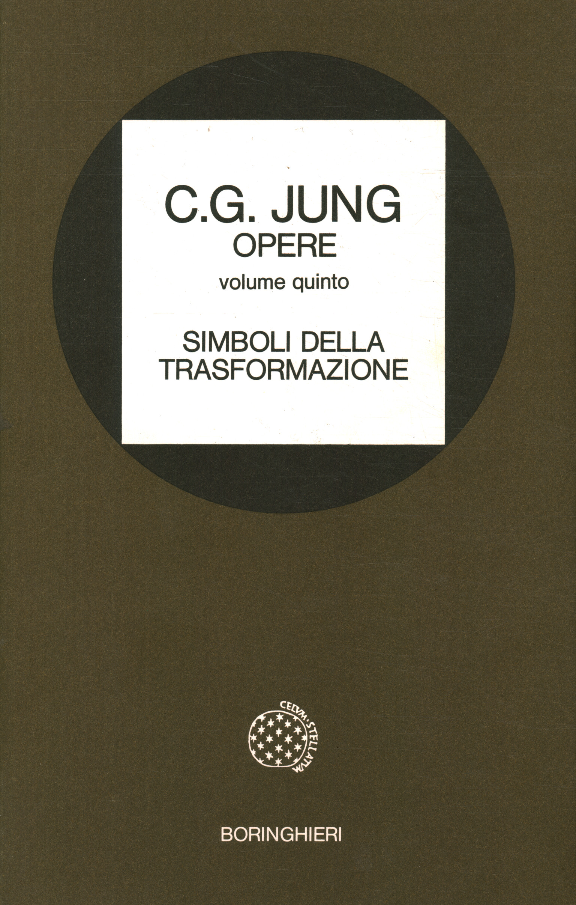
- 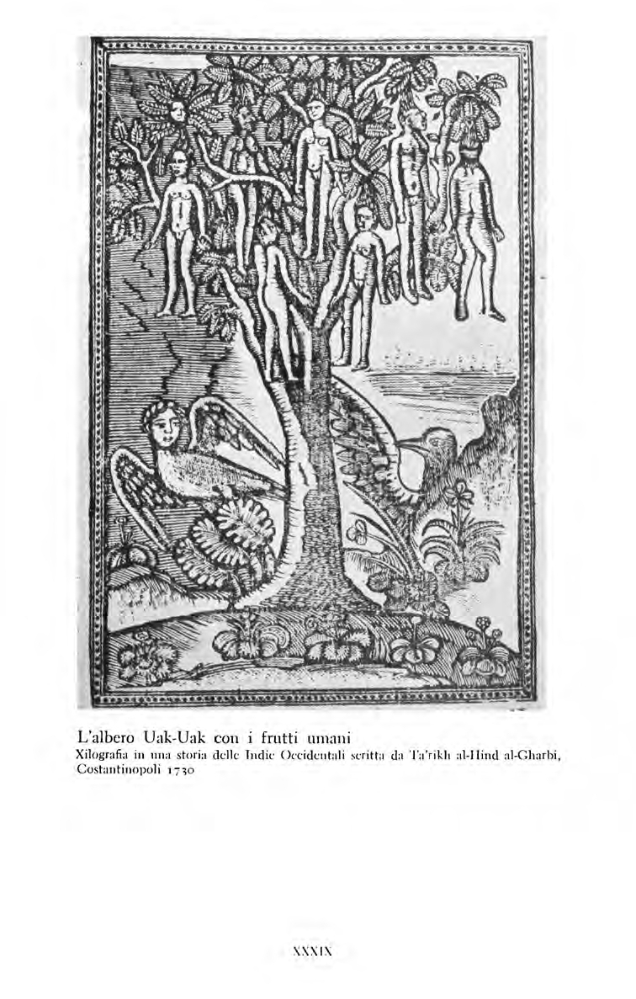

A monograph by Carl Gustav Jung

## 7. The Vak-Vak tree

- 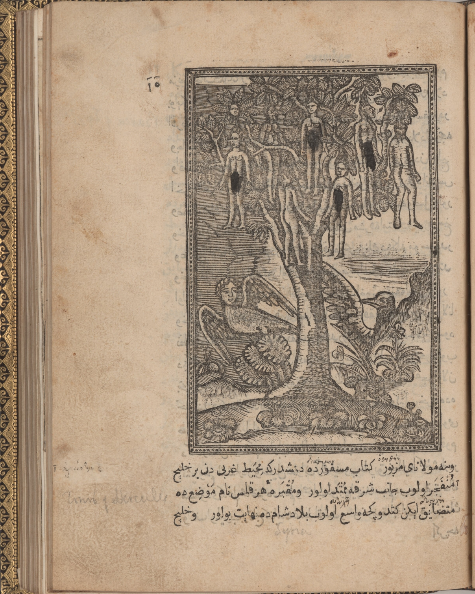

An illustration from Tarih-i Hind-i garbi

## 8. L'occhio degli occhi

- 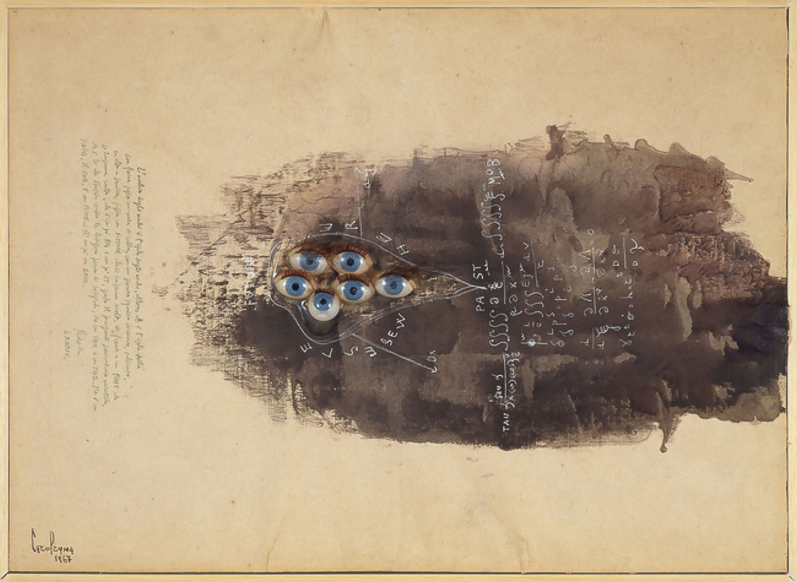

A painting by Carol Rama

## 9. Rooney, Monroe and Anthony

- 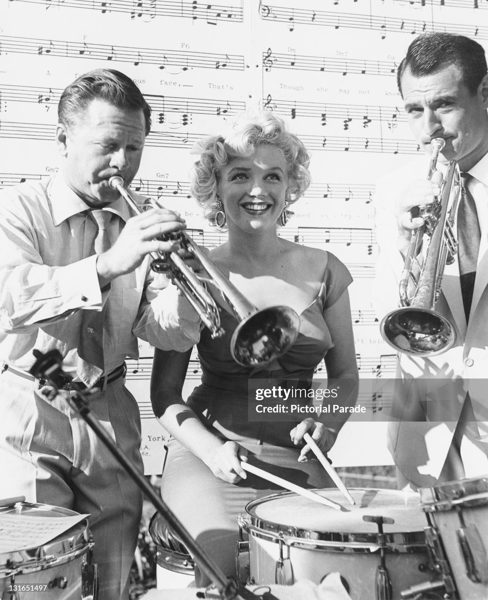

A photo of Marilyn Monroe taken at Ray Anthony's party in 1952

## 10. Marilyn

- 

A song by Ray Anthony and His Orchestra

## 11. Just what is it that makes today's homes so different, so appealing?

- 

A collage by Richard Hamilton

## 12. Young Romance

- 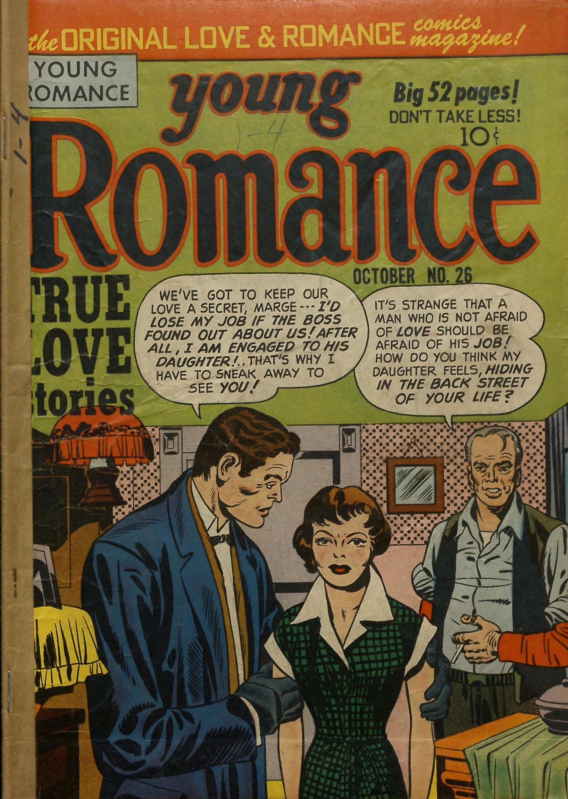

A comic book series created by Joe Simon and Jack Kirby

## 13. Go for your money

- 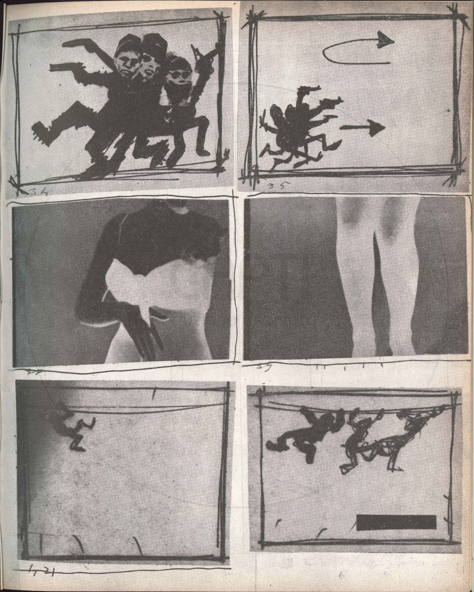

An animated film by Magdalo Mussio

## 14. The Lady from Shanghai

- 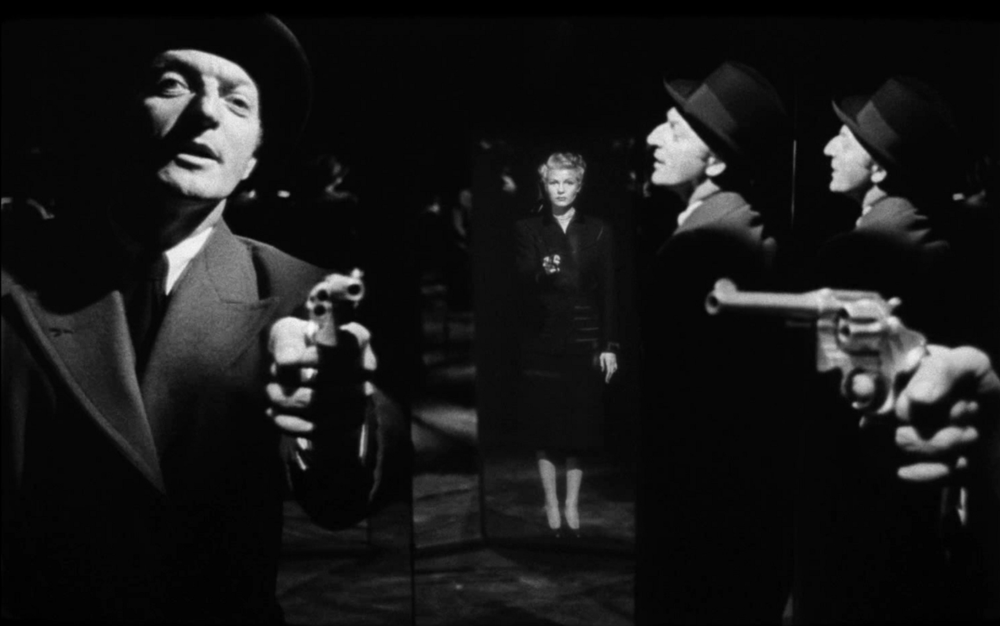

A film by Orson Welles
