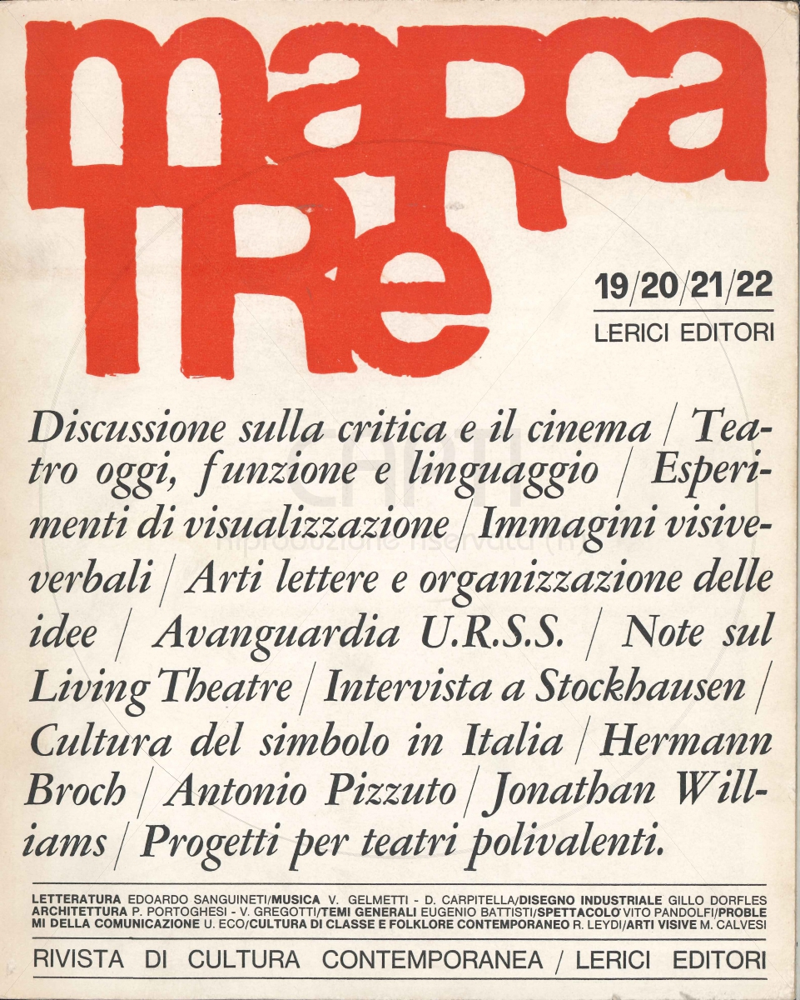

# Items

We conducted a selection from the total number of cultural objects described in the ekphrasis and recognized by scholars, using three specific criteria:

  1. The objects had to be published online with their metadata by a cultural institution responsible for their curation;
  2. The metadata for these objects needed to adhere to a standardized description, ideally following international standards for metadata;

  3. The selection was required to include a balanced variety of objects from the GLAM domain.

Additionally, we took scholarly interpretations into account to guide our search, ensuring that the items included in the sample exemplify intermedial references within the ekphrasis, along with broader external relations that could be modeled.

Ultimately, the final selection consists of 14 items, including Sanguineti's text itself and two other cultural objects related to _Il Giuoco dell’Oca_ that were not mentioned in the main chapters:

  1. The board game of the Game of the Goose, which inspired Sanguineti;
  2. Gianfranco Baruchello's _Il Giuoco dell’Oca di Edoardo Sanguineti_ which was conceived to reinterpret the traditional board game in the light of Sanguineti's work. 

All selected items come with metadata that, when possible, adhere to international standards. For those using proprietary schemas, the metadata has been aligned with an appropriate standard from the corresponding domain.

## 1. Il Giuoco dell'Oca
_A novel by Edoardo Sanguineti_

[Learn more  :octicons-book-16:](https://sol.unibo.it/SebinaOpac/resource/il-giuoco-delloca-romanzo/UBO00803295?locale=eng){ .md-button target="_blank" }

- 
- 
    <li class="span-2">
        
    </li>

## 2. Game of the Goose
_A board game by Marca Stella_

[Learn more  :octicons-book-16:](https://imago.sebina.it/opac/resource/giuoco-del-giro-del-mondo-giuoco-delloca/IMA00074201){ .md-button target="_blank" }

- 

## 3. Il Giuoco dell'Oca di Edoardo Sanguineti
_A collage by Gianfranco Baruchello_

[Learn more  :octicons-paintbrush-16:](https://artsupp.com/en/artisti/gianfranco-baruchello/gioco-dell-oca){ .md-button target="_blank" }

- 

## 4. Cassa Sistina
_A sculpture by Mario Ceroli_

[Learn more  :octicons-paintbrush-16:](https://www.centrepompidou.fr/fr/ressources/oeuvre/cyn6azb){ .md-button target="_blank" }

- 

## 5. Vampyr
_A film by Carl Theodor Dreyer_

[Learn more  :material-movie-roll:](https://web.archive.org/web/20250107143541/https://collections-search.bfi.org.uk/web/Details/ChoiceFilmWorks/150047864){ .md-button target="_blank" }

- 

## 6. Symbols of Transformation
_A monograph by Carl Gustav Jung_

[Learn more  :octicons-book-16:](https://bid.catalogobibliotecheliguri.it/MIL0025027){ .md-button target="_blank" }

- 
- 

## 7. The Vak-Vak tree
_An illustration from Tarih-i Hind-i garbi_

- 

[Learn more  :octicons-book-16:](https://americana.jcblibrary.org/search/object/jcbcap-ljcb-1-1-207-230331/){ .md-button target="_blank" }

## 8. L'occhio degli occhi
_A painting by Carol Rama_

[Learn more  :octicons-paintbrush-16:](https://asac.labiennale.org/attivita/arti-visive/361994){ .md-button target="_blank" }

- 

## 9. Rooney, Monroe and Anthony
_A photo of Marilyn Monroe at Ray Anthony's party in 1952_

- 

[Learn more  :material-movie-roll:](https://www.gettyimages.it/detail/fotografie-di-cronaca/actors-mickey-rooney-and-marilyn-monroe-fotografie-di-cronaca/131651497){ .md-button target="_blank" }

## 10. Marilyn
_A song by Ray Anthony and His Orchestra_

- 

[Learn more  :octicons-book-16:](https://purl.stanford.edu/hp730pz7495){ .md-button target="_blank" }

## 11. Just what is it that makes today's homes so different, so appealing?
_A collage by Richard Hamilton_

[Learn more  :octicons-paintbrush-16:](https://www.tate.org.uk/art/artworks/hamilton-just-what-was-it-that-made-yesterdays-homes-so-different-so-appealing-upgrade-p20271){ .md-button target="_blank" }

- 

## 12. Young Romance
_A comics magazine by Joe Simon and Jack Kirby_

- 

[Learn more  :octicons-book-16:](https://digitalcomicmuseum.com/index.php?dlid=26327){ .md-button target="_blank" }

## 13. Go for your money in Marcatrè
_An animated film by Magdalo Mussio_

[Learn more  :octicons-book-16:](http://www.capti.it/index.php?ParamCatID=10&IDFascicolo=799&artgal=38&key=8559&lang=EN){ .md-button target="_blank" }

- 
- 

## 14. The Lady from Shanghai
_A film by Orson Welles_

[Learn more  :material-movie-roll:](https://catalog.afi.com/Catalog/MovieDetails/25611){ .md-button target="_blank" }

- 

