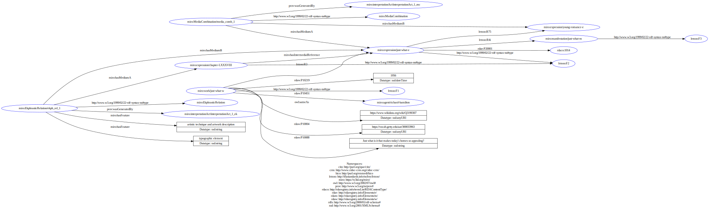

# Data production

```python title="Primo titolo"  linenums="1"
--8<-- "docs/data/scripts/conversion.py:1:53"
```

```python title="Secondo titolo"  linenums="1"
--8<-- "docs/data/scripts/conversion.py:105:190"
```

```python title="Terzo titolo"  linenums="1"
--8<-- "docs/data/scripts/conversion.py:1346:1351"
```

??? turtle "See RDF Dataset"

    ```turtle
    --8<-- "docs/data/dataset/rdf-turtle/gdo.ttl"
    ```

<div class="grid cards" markdown>
- 
</div>